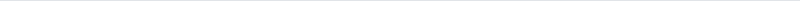
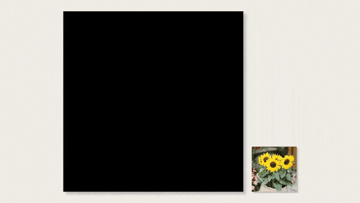
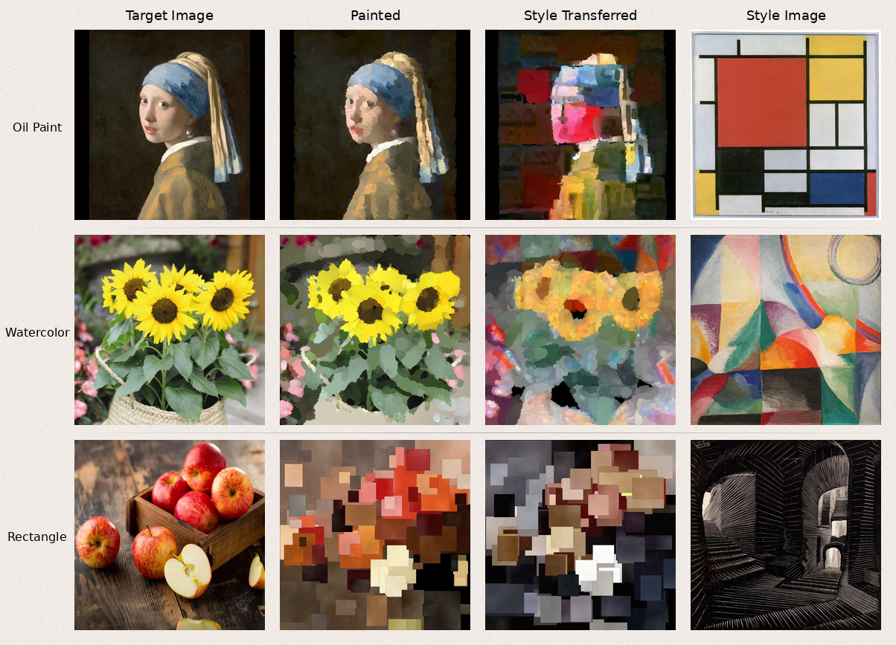

<h1 align="center">Stylized Neural Painting</h1>
<p align="center">
  <a href="https://colab.research.google.com/github/Druudik/stylized-neural-painting/blob/main/colab_demo.ipynb"></a>
  <a href="https://druudik.github.io/stylized-neural-painting"></a>
  <a href="https://github.com/Druudik/stylized-neural-painting/blob/main/WRITEUP.md"></a>
</p>
<p align="center">
    <b>Turn any image into a painting using your favourite type of brush, use style transfer to give it a unique look and render at any resolution!</b>
</p>
<picture>
    
</picture>
&nbsp;

This project is my modular reimplementation of [Stylized Neural Painting](https://jiupinjia.github.io/neuralpainter/) paper.
It's fully customizable and captures many details of the original implementation. I’ve also added several improvements and run an ablation
study on various components. All of that (and more!) is covered in the comprehensive **[writeup](WRITEUP.md)**.

<p align="center">
    
</p>

## Quick Start

The fastest way to try this out is the **[interactive Google Colab notebook](https://colab.research.google.com/github/Druudik/stylized-neural-painting/blob/main/colab_demo.ipynb)** which requires no setup.
Just upload your image, pick a brush (oil paint, watercolor, or grainy rectangle), hit run and watch it paint.
You can also apply style transfer using your style image to achieve a different artistic feel.

If you're looking for more customization and running this locally, there are two jupyter notebooks covering whole logic:
* `train_nn_renderer.ipynb`, training of a neural renderer that mimics your brush (prerequisite for painting).
* `paint.ipynb`, configurable painting and style transfer.

Both notebooks can be run from top to bottom right away. With default settings, `paint.ipynb` will
use an oil painting brush to paint sunflowers and then apply Picasso style transfer.

On top of customizing which images to paint and tweaking various other settings, you can 
also **[set up your own brush](WRITEUP.md#defining-your-own-brush)** which you can then use for painting!
It's as easy as implementing one method.

[Local setup](#local-setup) section guides you through setting up your environment.

## Brushes Available Out of the Box



## How It Works

Firstly, we have to define what we actually mean by the *brush stroke*: it's a function that takes 
parameter vector (position, color, size, etc.) and produces both an RGB image and an alpha mask. 
All parameters live in [0,1] range, so strokes can be rendered at arbitrarily high resolution.
A *painting* is just a sequence of these strokes that are alpha-blended onto a blank canvas.

We can easily frame *painting with a brush* as an optimization problem: 
generate $N$ random brush strokes, paint them one by one, compare visual similarity between the painting and 
the target image, and try to nudge the brush stroke parameters towards a better match.

Since brush parameters live in a continuous range, optimization via gradient descent seems like a natural choice.
The catch is that most brush renderers aren't differentiable with respect to all their parameters.
But! We can train a neural network to approximate the brush rendering function, and use that
differentiable stand-in during optimization. This completes the optimization loop.

One realization that makes things interesting is that "visual similarity" means whatever you want it to mean.
Plain pixel-wise loss pushes toward realism. But if you swap in a style transfer loss, 
you're suddenly painting like a Picasso!

There are a bunch of additional tricks and caveats that were introduced by the [paper](https://jiupinjia.github.io/neuralpainter/), but this is the main idea.
You can read about all the details and my improvements in the [writeup](WRITEUP.md).

## Local Setup

1\. Clone repository and enter the folder:
```bash
git clone https://github.com/Druudik/stylized-neural-painting.git && cd stylized-neural-painting
```

2\. If you don't have **uv** installed on your system, use official [guide](https://docs.astral.sh/uv/getting-started/installation/) to set it up.

3\. Create the environment and install all dependencies (uv will install Python 3.12+ automatically if needed):
```bash
uv sync
```

4\. Start a jupyter server instance and check out the `colab_demo.ipynb` to run Gradio demo app locally, or `paint.ipynb` for more customization:
```bash
jupyter lab paint.ipynb
```

**Note:** If you need PyTorch built for a specific CUDA version, install it separately after running `uv sync`.

## More Painting Examples

I've also set up a [GitHub page](https://druudik.github.io/stylized-neural-painting) where you can check out
many more **high-resolution** painting examples and videos from this project!

## License

MIT
