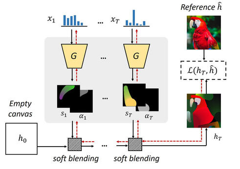

# Technical writeup

Here I describe all the technical details and nuances of my reimplementation of the [Stylized neural painting paper](https://jiupinjia.github.io/neuralpainter/).

Specifically, I talk about why each part of the algorithm matters, what I learned trying out different tweaks,
I mention all the implementation details, and finally provide an [easy guide to making your own brush](#defining-your-own-brush).

**Table of contents:**
- [Algorithm overview](#algorithm-overview)
- [Findings](#findings)
- [Improvements on top of the original paper](#improvements-on-top-of-the-original-paper)
- [Implementation details](#implementation-details)
- [Defining your own brush](#defining-your-own-brush)

## Algorithm overview

Just to recap: the goal of the algorithm is to place **parametrized brush strokes** on a canvas so that the final painting
resembles a **target image** and optionally style of the **style image**. The similarity between the painted canvas 
and the target is measured by a **loss function**, typically the pixel-wise mean absolute error. For the style transfer
it is more complex loss based on the intermediate layer activations of some deep neural network such as VGG-16.
So in essence, this can be formulated as an **optimization problem** where the parameters are brush stroke
attributes such as size, position, color, and the objective is visual similarity.
The advantage of using parametrized brush strokes is that we can render them on the canvas
of **any resolution** (or at least until your GPU gives up).

Ideally, we could solve this using modern **gradient descent optimizers**. However, there's a catch: the brush
stroke renderer isn’t necessarily **differentiable**. This means we can’t directly compute how small changes in the
brush parameters (the renderer’s input) affect the loss after painting the image and hence, we can not use gradient descent.
To work around this, we first **train a neural network** to approximate it. The network takes brush parameters as input and
outputs a rendered brush stroke **RGB foreground** along with its **alpha mask**. Since neural networks are 
**differentiable computational graphs**, we can **backpropagate** the loss directly to the **brush parameters**.

So the procedure becomes straightforward: generate a set of random strokes,
draw them sequentially (rendered stroke is a tuple of RGB foreground and alpha mask), 
compute arbitrary loss from the final painted canvas, backpropagate through the neural network, and 
update the stroke parameters using gradient descent. 
This is partially visualized on the following diagram ([source](https://github.com/jiupinjia/stylized-neural-painting)):

<p align="center">
  
</p>

But! **Gradient descent isn't a silver bullet.** Its effectiveness depends heavily on the gradient quality and structure of the
loss landscape. In our scenario, this landscape can be particularly messy with poor gradient signal for **overlapping**
strokes and with many **local minima**, created by small details or static backgrounds, that can easily "trap" brush strokes,
making naive optimization producing suboptimal results.

There are several tricks that were implemented in the original [paper](https://github.com/jiupinjia/stylized-neural-painting). I’ll cover them in the following sections.

### Progressive grid splitting

Instead of optimizing all strokes for the entire image at once, we **split the canvas** into a grid of **non-overlapping patches** 
and optimize each one separately. We start coarse, with optimization of the whole image (1 grid), and progressively go
finer: 2×2 (4 grids), 3×3 (9 grids), and so on. Coarse grids produce large strokes that capture the global structure,
while fine grids add smaller strokes for details.

**The neural network** (which I'll interchangeably refer to as *differentiable brush*) always renders at a **fixed canvas size** (e.g. 128×128).
So to paint on an image with, say, a 3×3 grid, we **resize** the canvas and target image to `3 × 128 = 384` pixels, then split 
it into 9 independent patches of 128×128 each.

The first iteration starts with an empty canvas, but subsequent iterations build upon strokes already drawn
with the **real** renderer. For example, when optimizing a 2×2 grid, the initial patches are not blank, they
already contain the strokes from the **previous coarser iteration**. These existing strokes are treated as
**fixed**: their parameters are no longer updated, and they act as a static background.

### Rescaling

Each grid's brush parameters live in **local [0, 1] coordinates**. The brush doesn't know where on the full
canvas its grid is located, it only sees its current state and the target it should resemble.

So, after optimization, we need to map these back to **full-canvas coordinates**. Position parameters are 
shifted by the grid's normalized top-left corner and scaled by the normalized grid size, and size parameters
are just multiplied by the normalized grid size. For example, a stroke at position (0.5, 0.5) in the top-left
grid of a 2×2 split ends up at (0.25, 0.25) on the full canvas.

After rescaling, strokes that ended up too **small** (below `min_brush_stroke_size` threshold) are **filtered
out** because they can be noisy (potentially because they were stuck in some weird local minima). The
final output is a flat list of normalized brush parameters that can be rendered at any resolution.

**One caveat with rescaling**: if the real brush has a **minimum rendered size** (i.e., even the smallest parameter
values produce a stroke much larger than a single pixel), rescaling can cause strokes from fine grids to **appear
disproportionately large** on the full canvas. Consider an extreme case where the brush always covers the
entire canvas regardless of its size parameters. A stroke optimized in a 5×5 grid would still span far
more than 1/25 of the canvas after rescaling, because dividing its size by 5 isn't enough to compensate
for the brush's inherent minimum footprint. In general, the actual rendered size before and after rescaling
**must scale proportionally with the grid size** for progressive splitting to work correctly.

### Clamping

During grid's optimization, all parameters are **clamped** to [0, 1] after each gradient step. 
Position parameters are further **constrained** by a `boundary_offset` (default 0.1) to **keep strokes 
from reaching to the neighbouring grids** (which they didn't see during optimization!), and size parameters
are kept within a configurable [min, max] range, both to **keep strokes within their grid** and to maintain
**reasonable gradient signal** throughout optimization (small strokes can get stuck).

### Active set optimization


Optimizing all N strokes **simultaneously** can be problematic. 
One reason is the way the alpha blending formula works when painting strokes on the canvas: 
`canvas = stroke_foreground * stroke_alpha + canvas * (1 - stroke_alpha)`

Imagine a scenario where the **last stroke** of those N strokes **ends up covering most of the canvas**:
if its alpha mask is 1 everywhere (completely opaque), **the gradients for all previous strokes
become zero**. This effectively prevents them from being optimized further.

On the other hand, optimizing strokes strictly one by one isn’t ideal either. 
This approach can prevent the optimizer from discovering **beneficial interactions between strokes**, and 
it can also be slower since each stroke is optimized independently.

A middle-ground approach is the **active set method**, where a small, gradually growing 
subset of strokes is optimized jointly. Here’s how it works:  

1. Sample a new stroke and add it to the **active set**.  
2. Run gradient descent on **all strokes in the active set** for a fixed number of steps.  
3. Add another new stroke to the active set and repeat the joint optimization.  
4. Continue until the active set reaches its maximum size (`active_set_size`).  

The total optimization budget for each active set cycle is `total_optim_steps`, which is evenly 
divided among the stages: `total_optim_steps / active_set_size` steps per stage. 
This means the first stroke gets optimized across all stages, gradually improving its position, 
while the last stroke only gets one round of optimization. Early strokes thus have more time to 
settle into good positions.  

Note that multiple active sets can be optimized within the same grid, one by one.
Once an active set finishes its `total_optim_steps`, its strokes are **frozen**, and
a new active set optimization begins from the updated canvas.
This kind of mirrors the way progressive grid optimization works, painting in a 
step-by-step manner.

### Target-guided sampling

In the same way that initialization is important when training neural networks, it's important here. **Smart initialization**
can significantly aid and **speed up optimization** by guiding strokes toward areas that need the most attention.

To achieve this, we first compute an **error map** between the current canvas and the 
target image (absolute pixel difference), optionally blur it for smoother sampling, and then raise it to the
4th power to emphasize high-error regions but still keep some randomness. 
This distribution is normalized and used for **sampling brush stroke positions**, so that they are
much more likely to land where the painting needs the most work.

**The color is initialized by reading from the target image** at the same sampled position, optionally from
a slightly blurred version to avoid picking up noise. Size parameters are initialized to a small random 
interval (e.g., 0.1–0.25 in normalized coordinates), not too small, because tiny strokes produce **weak
gradient signals** during optimization, and not too big, because large strokes would **bulldoze** over already 
well-painted regions. Everything else (angle, etc.) is randomized **uniformly**.


### Style transfer

Even though `Painter` can accept **any** kind of loss, using it directly with a weighted combination of pixel and style loss
was producing suboptimal results. The strokes often struggled to align in a way that both
resembles the target image and captures the style of the style image.
However, what we can do is first optimize brush strokes to match the **target only** (via pixel loss)
and **then** run the same optimization, with same boundary and size constraints, but
with **style loss**. This works much better and produces stylized painting that also captures content of the target image.

## Findings

In this section I summarize what I observed when I was experimenting with different parts
of the algorithm: what worked, what didn't, what was essential and what wasn't.

### Neural renderer (a.k.a. differentiable brush)

#### Renderer quality is critical

The quality of the differentiable brush (neural renderer) is very important.
If the neural renderer is imprecise or struggles with certain stroke shapes,
the entire optimization inherits those limitations. Investing in a well-trained
neural renderer pays off.

#### Small strokes can be challenging to learn

The differentiable brush can struggle to render small brush strokes.
This is because **the white background dominates MSE loss** during training.
That's why **minimum size clamping** and **progressive grid optimization** (which basically optimizes small
strokes but as a bigger ones which are then rescaled) is important during optimization.

#### Training

I found that simply training neural renderer for many iterations with the
**same learning rate** consistently kept the loss decreasing.
This held true for both the `ShadingRasterNetwork` from the original paper and the smaller, 
faster `ModulatedPixelShuffleNet` that I added.

The exact learning rate can still matter though. Some networks might work better with smaller/bigger lr.

Since I've had finite compute, I used a brief **fast decay near the end** to speed up the convergence,
though longer runs would likely continue to improve quality. Nonetheless, the painting
optimization worked well even in this setting.

### Painting optimization

#### Parameter clamping prevents artifacts

**Clamping parameters**, especially size, turned out to be very important.
Without it, and without proper target-guided sampling of brush strokes,
the optimization occasionally produced small, oddly colored brush stroke artifacts
that stood out from the rest of the painting.

#### Active set of size 1 is not that bad

Optimizing strokes **one by one**, rather than using an **active set**, wasn't as bad as expected.
But active set optimization still produced noticeably better results.
With an active set, strokes appeared more **natural and coherent**, as if placed with intent,
whereas one-by-one optimization tended to look more like **tapping** paint onto high-error spots.

#### Progressive grid splitting captures global and local structure

Progressive grid splitting, starting coarse and going finer, also proved beneficial.
Using only fine grids (e.g., 5×5) with the **same total stroke count** as in progressive schedule, produced worse results.
This may be partly due to the `boundary_offset`, which effectively **restricts**
where brush strokes can be placed on the canvas (when using a single fixed number of grids there are guaranteed **dead zones**),
as well as other factors, such as smaller possible brush strokes.

### What didn't matter much

#### Sinkhorn loss seems not that needed with target-guided sampling

The original paper introduces the **Sinkhorn loss** to address a specific failure mode of pixel-wise MAE:
when a brush stroke's **color matches the background**, small changes in position don't affect the loss,
so **position gradients are basically zero**. Sinkhorn loss, based on **optimal transport**, does solve this.
However, in practice, **target-guided sampling** already places strokes in high-error regions, making this
scenario rare. As a result, Sinkhorn loss turned out to be unnecessary in most settings.

#### Position gradient smoothing

In theory, position parameters should also suffer from poor gradient signal because the canvas
consists of **discrete pixels** which means, shifting a stroke by a fraction of a pixel
shouldn't change anything. In practice, however, most brush renderers use **interpolation**,
so small position changes do propagate meaningful gradients. Still, I've decided to experiment
with adding **small random noise** to position parameters during neural renderer **training** (while keeping the
target unchanged), to see if this would improve painting optimization in a meaningful way.
It looked promising but the change was not so drastic so I turned it off.
That said, I think that this might still be worth revisiting.

## Improvements on top of the original paper

### Alpha-weighted brush stroke loss

As mentioned earlier, the **differentiable brush** can struggle a little with properly rendering small brush strokes
during training because the **background** dominates the MSE loss.

To address this, there's a `WeightedBrushStrokeLoss` which adds an **extra loss term** that weights each 
foreground pixel's contribution by its **alpha value**, putting more emphasis on the brush stroke itself. 
This seemed to help with small brush strokes, so it's used by default during training.

### Color mask neural renderer

Some brushes produce **foreground** pixels that range from black to a **single** target RGB color.
There are **no other hues** involved, just **varying intensity of one color**. For these brushes,
the network doesn't need to accept color parameters as the input and it doesn't need to predict full **4 channel RGBA** output.
Instead, `ColorMaskNeuralRenderer` uses neural network that
predicts only **2 channels**: a color intensity mask and an alpha mask. The final foreground is computed by
**interpolating** between black and the target color using the following formula:
`foreground = mask * 255 * color`. This leads to faster and more efficient training. It was used with the `WatercolorBrush`.

### Separate foreground and alpha masks 

In the original [paper](https://github.com/jiupinjia/stylized-neural-painting), they use 
`ZouFCNFusion` class as underlying [model](https://github.com/jiupinjia/stylized-neural-painting/blob/main/networks.py),
which is network that predicts a **single shared** `mask` that is used for both the foreground shape and the alpha transparency.
The foreground is computed as `color_shader_nn_output * mask` and the alpha mask as `alpha_param * mask` (note that `color_shader_nn_output`
has same spatial dimensions as mask and that `alpha_param` is scalar). This forces the `mask` to **serve two roles** simultaneously:
defining the colored foreground and defining the transparency. When the alpha mask is more complex and doesn't perfectly 
correspond to the foreground, then single `mask` has to compromise between the two. Or alternatively, the network needs to 
learn to output bigger/smaller values in the `color_shader_nn_output` to compensate for that which makes training less efficient.

The improvement here is to have the rasterization network predict **two separate masks**, one for
the foreground and one for the alpha channel, so each can specialize independently.
This improved training performance.

### Corrected style loss normalization

The original implementation builds Gram matrices from several VGG layers and **sums** the squared differences
to compute style loss. Because it uses a sum instead of a **mean**, Gram matrices from layers with larger
spatial size (or more channels) have **larger magnitudes** and therefore contribute more to the loss.
This means that those layers have indirectly higher weight. 
This should be ideally configurable and not reliant on the layer's definition.
`GatysStyleLoss` fixes this by using the **mean instead of the sum**, and provides default **layer
weights** that match the original paper's intended balance.

### Smaller, modulated neural renderer

By default, we use `ModulatedPixelShuffleNet` instead of the original paper's
architecture. This network uses **FiLM** (Feature-wise Linear Modulation) conditioning, 
which makes it roughly 40% smaller, 35% faster to train and 65% faster when painting, 
all while having similar performance (measured using Kaggle free GPU P100).

## Implementation details

The codebase is built with modularity in mind, allowing every component to be swapped 
or customized. A key customization you may find useful is creating your own brush, 
which is as simple as implementing a single method. 
You can check *Defining your own brush* section to get the full example.

In order to see how everything is connected, you can check out the full training and
painting pipelines in the notebooks `train_nn_renderer.ipynb` and `paint.ipynb` respectively.

Note that all source code lives in the `painting/` folder and is well-documented. 
So if you need additional details beyond what's covered here, you can refer to the docstrings.

### Core classes

The system is built around a few key abstractions that map directly to the algorithm described earlier.

**Brush** (`brushes.py`)

Abstract base class for all brush renderers.
It defines a key abstract method: `render_brush_stroke(brush_params)` which takes
normalized parameters in `[0, 1]` and returns a tuple of `(foreground, alpha_mask)`.
The foreground is an RGB image with values in `[0, 255]`, and the alpha mask has values
in `[0, 1]`. Drawing on a canvas uses standard alpha blending:
`canvas = foreground * alpha + canvas * (1 - alpha)`.

**DifferentiableBrush** (`brushes.py`)

Extends `Brush` and `nn.Module`, making it suitable for gradient-based optimization.

**Painter** (`painter.py`)

Orchestrates the main painting optimization loop with grid splitting etc.
Uses `Brush` and `DifferentiableBrush`.

**Imitator** (`imitator.py`)

Handles training a `DifferentiableBrush` to imitate a real `Brush`.

**Sampler** (`samplers.py`)

Provides intelligent initialization for random brush parameters. Used by `Painter`.

**StyleTransferer** (`style_transferer.py`)

Takes brush parameters output from `Painter.paint()` and optimizes them to transfer style from a reference image
while preserving content. The optimization loop is very similar to the `Painter`.

### Loss functions

The codebase provides several loss functions for different purposes.

**Image losses** (`painting/loss/image.py`) measure similarity between rendered canvases and target images:

- `PixelLoss`: Standard L1 or L2 pixel-wise loss.
- `SinkhornLoss`: Earth mover's distance using the Sinkhorn algorithm.
- `GatysStyleLoss`: VGG16-based Gram matrix loss for style transfer.

**Brush stroke losses** (`painting/loss/brush_stroke.py`) are used when training neural renderers to imitate real brushes:

- `MSEBrushStrokeLoss`: Simple MSE between predicted and target RGBA brush strokes.
- `WeightedBrushStrokeLoss`: Addresses problem with smaller strokes.

### Existing brushes

Three brush implementations are provided out of the box.

**WatercolorBrush** (10 parameters) creates a bleeding watercolor effect by stacking deformed polygon textures along a quadratic Bezier curve trajectory.

| Index | Parameter | Description |
|-------|-----------|-------------|
| 0-1 | x0, y0 | Start point of Bezier curve |
| 2-3 | x1, y1 | Control point (curve midpoint) |
| 4-5 | x2, y2 | End point |
| 6 | radius | Brush size |
| 7-9 | r, g, b | Stroke color |

**TextureBrush** (11 parameters) produces oil-brush style strokes using pre-loaded texture images with smooth color gradients.

| Index | Parameter | Description |
|-------|-----------|-------------|
| 0-1 | xc, yc | Center position |
| 2-3 | w, h | Width and height |
| 4 | angle | Rotation angle |
| 5-7 | R0, G0, B0 | Start color (gradient) |
| 8-10 | R1, G1, B1 | End color (gradient) |

**RectangleBrush** (7 parameters) draws axis-aligned rectangles with grainy watercolor texture effects.

| Index | Parameter | Description |
|-------|-----------|-------------|
| 0-1 | xc, yc | Center position |
| 2-3 | width, height | Dimensions |
| 4-6 | r, g, b | Fill color |

Texture brush is the most realistic one, suitable in the most cases.
Watercolor is slightly more noisy with the *side leaking* effect. 
Rectangle brush is the most abstract and constrained one. It works best
with images that have very few objects.

### Neural renderers

Two neural renderer wrappers are provided for creating differentiable brushes.

**GeneralNeuralRenderer** wraps any neural network that outputs **4-channel RGBA** images.

**ColorMaskNeuralRenderer** is optimized for brushes that blend **between black and a single color** (like `WatercolorBrush`). 
Instead of predicting full RGB, the network predicts only two channels: a color intensity mask and an alpha mask.

### End-to-end jupyter notebooks

The codebase contain 2 notebooks showcasing complete training and painting pipeline: 
`train_nn_renderer.ipynb` and `paint.ipynb`. They work out of the box with default configuration
but are fully customizable. You can check them out for additional details.

## Defining your own brush

Creating a custom brush requires implementing just three things: the parameter count, canvas size, and the `render_brush_stroke` method. Here's a complete example of a `CircleBrush` that draws soft-edged circular dots:

```python
import torch
from torch import Tensor
from painting.brushes import Brush


class CircleBrush(Brush):
    """Brush that draws soft-edged circular dots."""

    def __init__(self, canvas_size: int = 128, device: str = "cpu"):
        self._canvas_size = canvas_size
        self.device = device

        # Pre-compute coordinate grids for distance calculations
        y, x = torch.meshgrid(
            torch.linspace(0, 1, canvas_size, device=device),
            torch.linspace(0, 1, canvas_size, device=device),
            indexing="ij"
        )
        self._coords = torch.stack([x, y], dim=0)  # [2, S, S]

    @property
    def brush_params_count(self) -> int:
        return 6  # xc, yc, radius, r, g, b

    @property
    def canvas_size(self) -> int:
        return self._canvas_size

    def render_brush_stroke(self, brush_params: Tensor, *args, **kwargs) -> tuple[Tensor, Tensor]:
        """Render circular brush strokes.

        Args:
            brush_params: Normalized parameters [B, 6] in range [0, 1].
                Order: [xc, yc, radius, r, g, b]

        Returns:
            Foreground [B, 3, S, S] in [0, 255] and alpha mask [B, 1, S, S] in [0, 1].
        """
        batch_size = brush_params.shape[0]

        # Extract and denormalize parameters
        xc, yc = brush_params[:, 0], brush_params[:, 1]
        radius = brush_params[:, 2] * 0.4 + 0.02  # Map to [0.02, 0.42]
        color = brush_params[:, 3:6] * 255  # [B, 3]

        # Compute distance from center for each pixel
        center = torch.stack([xc, yc], dim=1)[:, :, None, None]  # [B, 2, 1, 1]
        dist = ((self._coords - center) ** 2).sum(dim=1, keepdim=True).sqrt()  # [B, 1, S, S]

        # Create soft-edged alpha mask
        alpha_mask = torch.clamp(1.0 - dist / radius[:, None, None, None], 0, 1)

        # Create foreground with solid color
        foreground = color[:, :, None, None].expand(batch_size, 3, self._canvas_size, self._canvas_size)

        return foreground, alpha_mask
```

To use your custom brush for painting:

1. **Train a neural renderer** using `train_nn_renderer.ipynb`. Configure the `Imitator` with your brush and a `ColorMaskNeuralRenderer` (if your brush uses simple color blending) or `GeneralNeuralRenderer` (for complex color mixing).

2. **Configure the Painter** with parameter index mappings. For `CircleBrush`:
   - `brush_pos_indices=[(0, 1)]` - the (x, y) position is at indices 0 and 1
   - `brush_size_indices=[2]` - radius is at index 2
   - For the `TargetGuidedSampler` you also need to specify color params: `color_param_indices=[(3, 4, 5)]`

3. **Run painting** using `paint.ipynb` with your trained differentiable brush and configured `Painter`.
